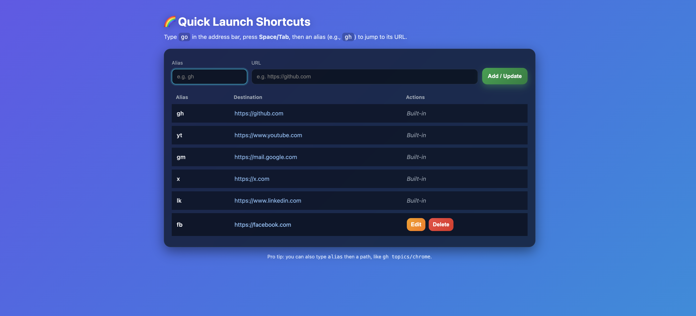
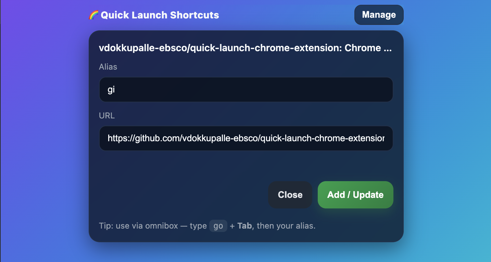

# 🚀 Quick Launch Shortcuts – Chrome Extension

Quick Launch Shortcuts is a customizable Chrome extension that lets you **open websites quickly using short aliases** via the Chrome omnibox (address bar) or the extension popup.


---

## ✨ Features

- **Omnibox Shortcuts**: Type `go` + **Tab** + alias → instantly open the site.
- **Custom Aliases**: Add, edit, and delete shortcuts via the Options page.
- **Default Aliases**: Common sites like GitHub, YouTube, etc., included by default (read-only).
- **Toolbar Button**: Quickly add the current page as a shortcut with one click.
- **Context Menu**: Right-click on any page → “Add this page to Quick Launch…”.
- **Sync Storage**: Aliases saved in Chrome Sync storage for use across devices.

---

## 📂 Project Structure

```
quick-launch-shortcuts/
│
├── icons/                # All icon sizes (16, 32, 48, 128 px)
│   ├── icon16.png
│   ├── icon32.png
│   ├── icon48.png
│   └── icon128.png
│
├── html/                 # HTML pages
│   ├── options.html       # Options page for managing aliases
│   └── add_current.html   # Popup to add the current page as a shortcut
│
├── js/                   # JavaScript files
│   ├── options.js         # Logic for the Options page
│   ├── add_current.js     # Logic for the popup page
│   └── background.js      # Service worker: omnibox, context menu, default aliases
│
├── screenshots/          # Screenshots & GIFs for README
│   ├── demo.gif
│   ├── options-page.png
│   └── popup.png
│
├── common.css            # Shared styling for popup & options
├── manifest.json         # Extension manifest (permissions, scripts, pages)
└── README.md             # This readme file
```

---

## ⚡ Setup & Installation

1. **Clone or download** this project folder.
2. Open Chrome and go to:

   ```
   chrome://extensions/
   ```

3. Enable **Developer mode** (top right toggle).
4. Click **Load unpacked** and select this project folder.
5. The extension should now appear in the Chrome toolbar.

---

## 🖱️ How to Use

### Add a shortcut

- Click the extension icon → Add alias + URL → **Save**
- Or use right-click context menu → **Add this page to Quick Launch…**



### Launch a shortcut

1. In the Chrome address bar, type:

   ```
   go <Tab or Space> alias
   ```

2. Hit **Enter** to open the saved website.



---

## 🛠️ Development

- HTML files live inside the `html` folder.
- JS files live inside the `js` folder.
- CSS styles are shared via `common.css` for consistent UI.
- Default aliases are defined in `js/background.js`.

After changes:

- Go to `chrome://extensions/`
- Click **Reload** under this extension to apply changes.

---

## 📦 Building Icons

All icon sizes (16, 32, 48, 128 px) are required in the `icons/` folder.
You can export them from `icon.svg` using Figma, Inkscape, or any online SVG → PNG tool.

---

## 📜 License

This project is open-source under the MIT License.
Feel free to use, modify, and distribute it.

---

## 🙌 Credits

- Rocket icon inspired by your provided SVG.
- Built using [Chrome Extensions Manifest V3](https://developer.chrome.com/docs/extensions/mv3/).

---
